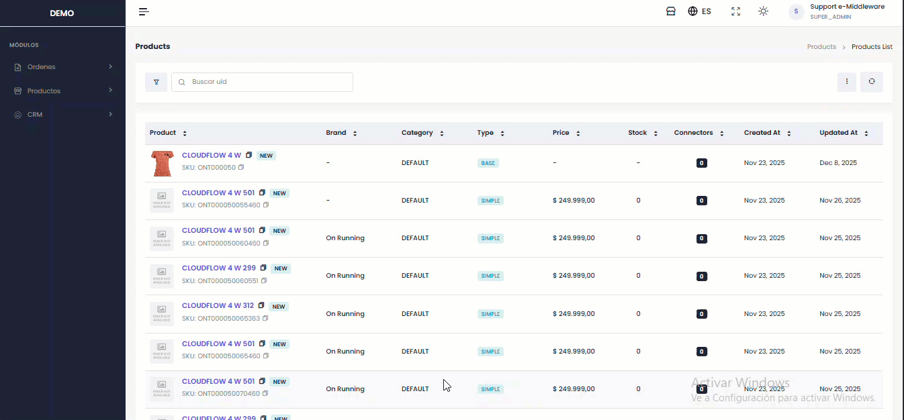

# ✏️ Editor Base

Para editar la información del producto, hacer clic en el **Botón de Editar**, se habilitan varios campos relevantes para modificación.&#x20;

A continuación, se detallan las opciones disponibles para editar:

#### Información de Producto

* Nombre
* Categoría
* Variantes&#x20;
* Tags

#### Atributos

* General
* Seo

**Opciones de confirmación:**

* **Descartar:** Cancela todos los cambios y restaura la información original.
* **Guardar Edición:** Confirma y guarda las modificaciones realizadas.

<figure><figcaption></figcaption></figure>
