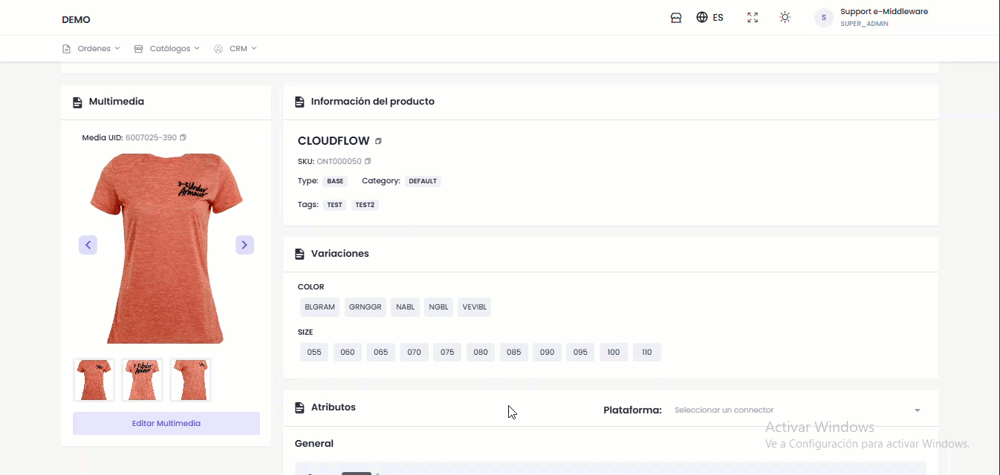
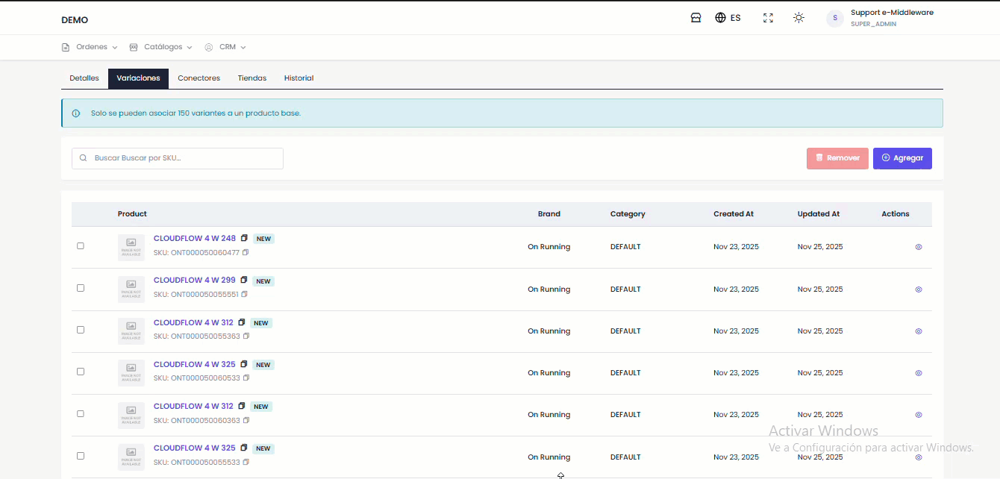
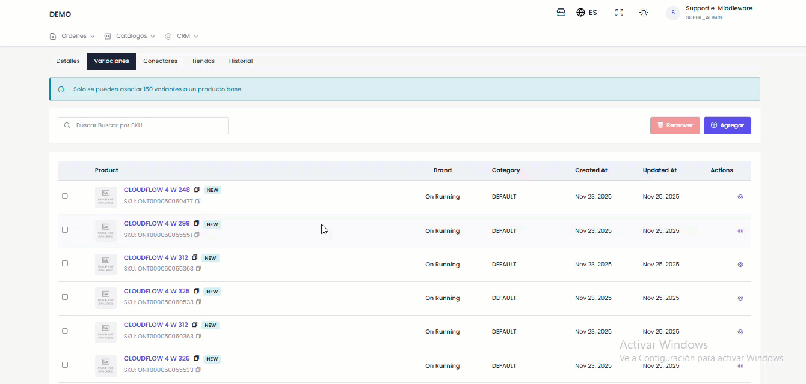
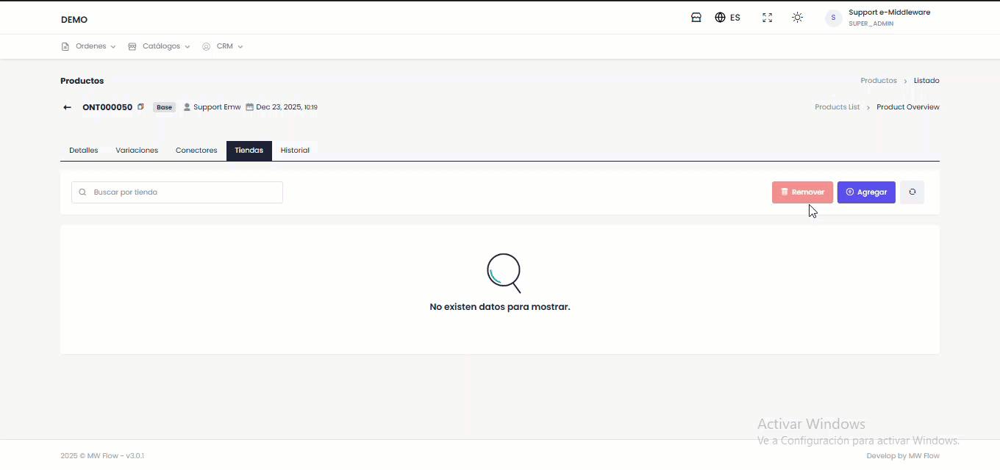

# Información General

#### **Sección 1: Detalles del Producto**

En esta sección central se visualiza, gestiona y sincroniza toda la información fundamental de un producto Base. Desde este panel se tiene acceso a las siguientes acciones principales:

* **Botón de Sincronizar**&#x20;

<figure><figcaption></figcaption></figure>

* **Editar Producto**

<figure><figcaption></figcaption></figure>

* **Refrescar Vista**

<figure><figcaption></figcaption></figure>

* **Multimedia:** Se puede editar la multimedia desde el producto, dando click en ese botón y buscar el set de imagen que quiere para el producto

<figure><figcaption></figcaption></figure>

* **Información del Producto:** Contiene información importante del producto seleccionado

<figure><figcaption></figcaption></figure>

* **Variaciones**

<figure><figcaption></figcaption></figure>

* **Atributos**

***

#### **Sección 2: Variaciones**

**Elementos de la Interfaz:**

* **Buscador:** Permite buscar productos especifico ingresando su Sku
* **Botón "Remover":** Seleccionar el producto y dar clic en el botón Remover

<figure><figcaption></figcaption></figure>

* **Botón "Agregar":**
  * Al hacer clic, se abre un modal que contiene:
    1. Un buscador de productos.
    2. Una lista de productos para seleccionar.
    3. Un botón **"Aplicar"** para confirmar la selección.

<figure><figcaption></figcaption></figure>

**Información del producto:**

* Producto:
* Brand (Marca)
* Categoría
* Fecha de creación
* Fecha de actualización
* Acción (botón para ver detalles del producto)

***

#### **Sección 3: Conectores**

**Columnas de la tabla:**

* Connector UID
* Connector Name
* Integration
* Ref Code
* Active (Activo)
* Inventory Update (Actualización de Inventario)
* Status (Estado)
* Message (Mensaje)
* Last Sync (Última Sincronización)

***

#### **Sección 4: Tiendas**

<figure><figcaption></figcaption></figure>

***

#### **Sección 5: Historial**

El historial contiene un registro completo de toda las actividades realizadas.&#x20;

* **Buscador**: Herramienta para filtrar y encontrar registros específicos
* **UID**: Identificador único de cada registro
* **Action**: Tipo de acción realizada
* **Message**: Descripción detallada de la acción
* **Data**: Información adicional o datos relacionados
* **Emitted at**: Fecha y hora exacta de la acción

***
