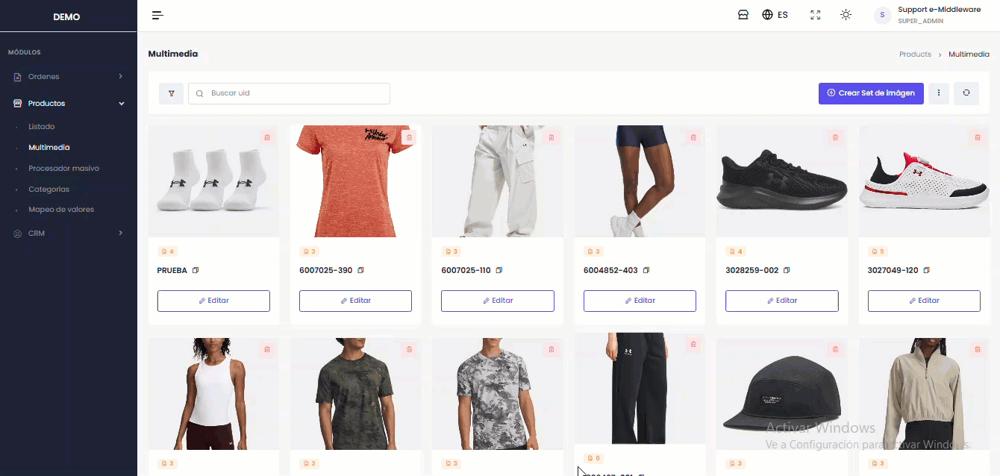

# Multimedia

#### **Elementos Disponibles en la Pantalla:**

* **Buscador**

<figure><figcaption></figcaption></figure>

* **Botón "Refrescar"**: Actualiza la vista actual y carga los cambios más recientes

<figure><figcaption></figcaption></figure>

* **Filtrado avanzado**: Para más información del paso a paso [haz clic aqui](https://docs.e-middleware.com/ordenes/ordenes-standard/creacion)

#### Proceso para Crear un Set de Imágenes

**Paso 1: Inicio**

* Haga clic en el botón **"Crear set de imagen"**, ubicado en la esquina superior derecha.
* Se desplegará una ventana modal para continuar.

**Paso 2: Asignar título**

* En el campo **"Ingresar título del producto"**, escriba un título que contenga solo letras y números.

**Paso 3: Agregar imágenes**

* Elija una de las siguientes opciones para añadir archivos:
  * **Arrastrar y soltar:** Arrastre la imagen o video desde su dispositivo al área indicada en la ventana.
  * **Mediante enlace:** Pegue la URL directa en el campo **"Agregar un enlace"** y presione el botón **"Agregar"**.

**Paso 4: Finalizar**

* Verifique que la información y los archivos sean correctos.
* Para guardar el set, haga clic en **"Aplicar"**.


Solo se puede agregar (8) imágenes y (2) Videos


<figure><figcaption></figcaption></figure>

#### **Pasos para Editar un Set de Imágenes**

1. Hacer clic en el botón editar, se abrirá un modal donde el usuario podrá editar el set de imagen

<figure><figcaption></figcaption></figure>

