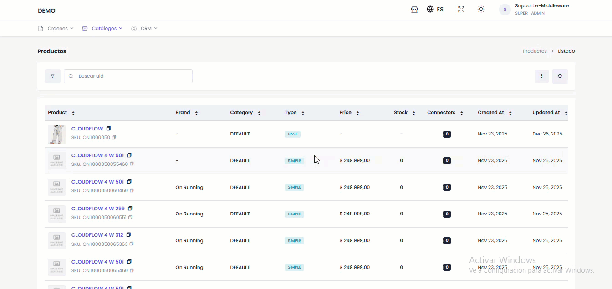

# ✏️ Editar Simple

Para editar la información del producto, siga estos pasos:

1. Desde el listado de productos ubicar el **botón** de "Editar"&#x20;

<figure><figcaption></figcaption></figure>

El usuario tiene la capacidad de editar la información del producto a través de las siguientes secciones:

#### 1. Información Básica

* Nombre
* Categoría
* Tags (Etiquetas)

#### 2. Atributos y Especificaciones

* Plataforma&#x20;
* Marca
* Tamaño Sugerido

#### 3. Variaciones

* Color
* Código de Color&#x20;
* Talle&#x20;

#### 4. Configuración SEO

* Título SEO
* Descripción SEO
* Palabras Clave SEO

**Opciones de confirmación:**

* **Descartar:** Cancela todos los cambios y restaura la información original.
* **Guardar Edición:** Confirma y guarda las modificaciones realizadas.
