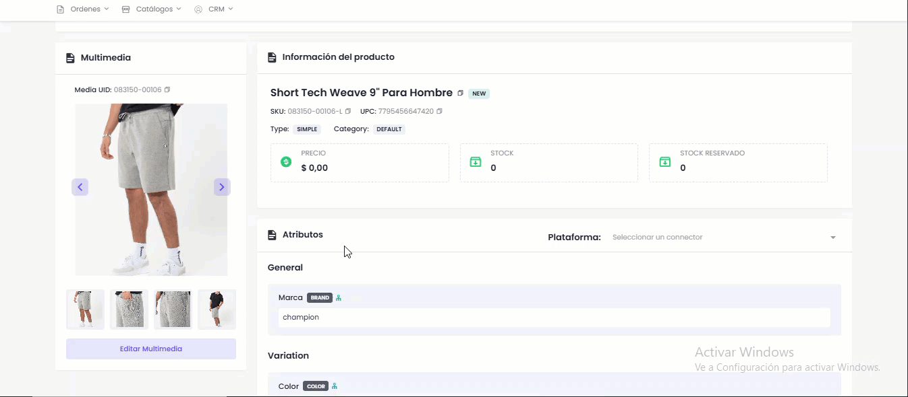

# Información General

#### **Sección 1: Detalles del Producto**

En esta sección central se visualiza, gestiona y sincroniza toda la información fundamental de un producto simple. Desde este panel se tiene acceso a las siguientes acciones principales:

* **Botón de sincronizar:**&#x20;

<figure><figcaption></figcaption></figure>

* **Editar Producto**&#x20;

<figure><figcaption></figcaption></figure>

* **Refrescar Vista**

<figure><figcaption></figcaption></figure>

* **Multimedia**: Se puede editar la multimedia desde el producto, dando click en ese botón y buscar el set de imagen que quiere para el producto

<figure><figcaption></figcaption></figure>

* **Información del producto:** Contiene información importante del producto seleccionado

<figure><figcaption></figcaption></figure>

* **Atributos**

