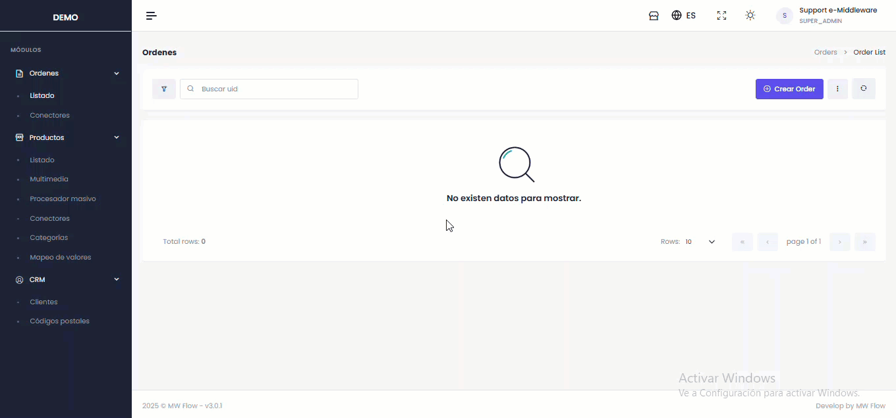
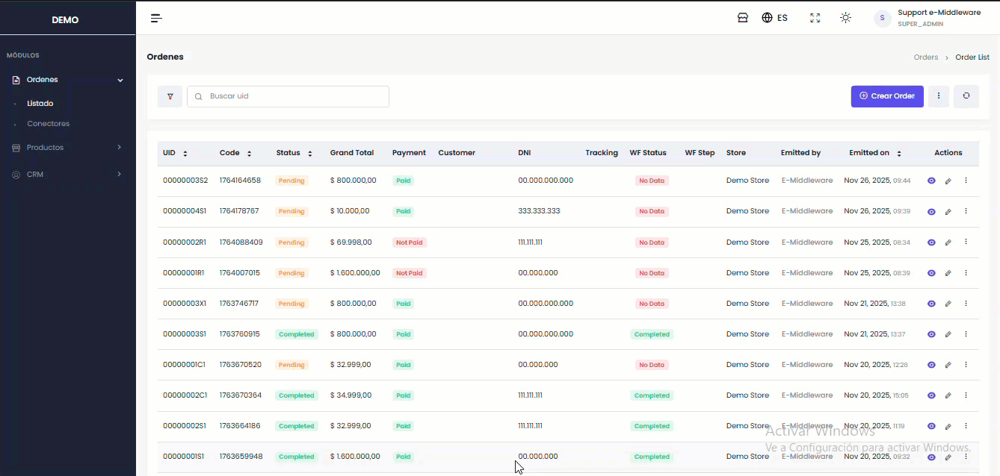

# Filtrado avanzado

El ícono de **filtro**, a la izquierda del buscador, abre el panel de filtrado avanzado. Está en
todos los listados y se usa siempre igual.

<figure><figcaption></figcaption></figure>

## Armar un filtro

1. **Agregar filtro** habilita una condición nueva.
2. Complete los tres campos:
   - **Campo** — qué dato quiere mirar.
   - **Operador** — cómo comparar: igual, contiene, mayor que…
   - **Valor** — contra qué comparar.
3. Repita para sumar condiciones. Se aplican **todas juntas**.
4. **Filtrar** aplica y cierra el panel.

<figure><figcaption></figcaption></figure>


💡 Los campos disponibles cambian según el módulo: en Órdenes puede filtrar por canal o estado; en
Productos, por SKU o categoría.


## Filtros guardados

Si usa siempre la misma combinación, guárdela. Queda en la lista **Filtros guardados** del panel y se
aplica con un clic.


⚠️ Aplicar un filtro guardado **reemplaza por completo** lo que tuviera puesto: no se suma a los
criterios actuales.


## Saber qué filtros están activos

- El ícono de filtro **cambia de color** y muestra un número: cuántas condiciones hay aplicadas.
- Pasando el cursor por encima aparece el detalle de todas.

<figure><figcaption></figcaption></figure>

## Limpiar

**Reiniciar**, al pie del panel, borra todas las condiciones y devuelve el listado a su vista normal.


⚠️ ¿El listado "no trae nada" o faltan registros que sabe que existen? Casi siempre hay un filtro
activo olvidado. Mire el color del ícono antes de dar por perdido un registro.

