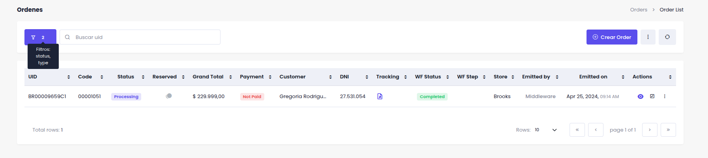

# Filtrado Avanzado

El botón de filtrado avanzado se encuentra a la izquierda del campo de búsqueda principal en todos los listados. Al hacer clic en el ícono de filtro, se desplegará un modal con la siguiente información.

<figure><figcaption></figcaption></figure>

1. Filtros Guardados

* Muestra una lista de filtros anteriormente guardados.
* Al seleccionar uno, los campos se actualizarán automáticamente con los criterios guardados.
* Los filtros anteriores se reemplazarán completamente por los nuevos criterios.

<figure><figcaption></figcaption></figure>

2. Agregar nuevos filtros

* Seleccione "Agregar filtro" para habilitar los campos de filtrado.
* Complete los campos:

1. **Campo**: Elija la categoría que desea filtrar
2. **Operador**: Seleccione el tipo de comparación (igual, contiene, mayor que, etc.)
3. **Valor**: Ingrese el criterio específico para filtrar

* Haga clic en el botón "Filtrar" para aplicar los filtros y ver los resultados en el listado.

<figure><figcaption></figcaption></figure>

3. Botón de Reset/Reiniciar:

* Ubicado en la parte inferior del panel de filtros.
* Al hacer clic: elimina todos los filtros aplicados actualmente.
* Restablece la vista a los valores predeterminados del listado.

4. Resumen visual de los filtros aplicados:

**Indicador de estado:**

* El botón de filtro cambia de color cuando hay filtros activos
* Muestra un badge con el número de filtros aplicados

<figure><figcaption></figcaption></figure>

Visualización de detalles:

* Al posicionar el cursor sobre el botón de filtro, se muestra un tooltip con el listado de todos los filtros activos.

<figure><figcaption></figcaption></figure>

5. Botón de actualizar/refrescar:

* Botón (↻) ubicado la parte superior de la derecha
* Al hacer clic actualiza los datos mostrados en el listado
* El botón se desactiva automáticamente al ser presionado y permanece inactivo durante 15 segundos (con indicador de progreso) antes de poder usarse nuevamente.
