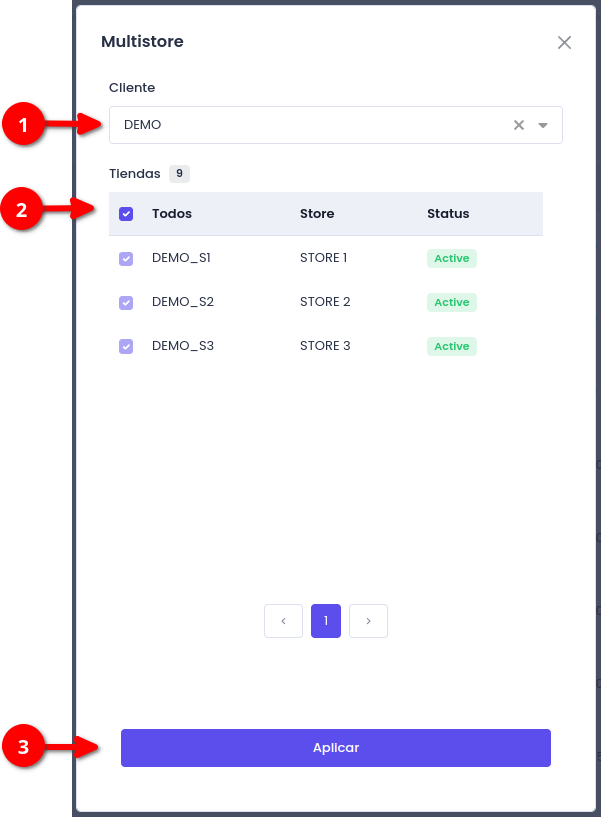

# Multi-Tienda


El **EMW** por defecto esta configurado para trabajar con multiples tiendas en simultaneo, para optar a configurar nuevas tiendas [_comuniquese con soporte_](https://app.gitbook.com/u/SvK4k8Van9ObqOAT0tcYT4b4pbk2)!&#x20;


#### Proceso de Selección de Cliente y Tienda

1.  **Botón de Tienda:**

    * En la parte superior de la plataforma, habrá un botón con el icono . Este botón será visible y accesible para los usuarios.

    <figure><figcaption></figcaption></figure>
2.  **Modal de Selección:**

    * Al hacer clic en el botón con el icono de "Tienda", se abrirá un modal que permitirá a los usuarios realizar las selecciones necesarias.

    <figure><figcaption></figcaption></figure>
3.  **Campos a Seleccionar:**

    * **Cliente:** por defecto tendra seleccionado el cliente registrado en la plataforma, si posee varios clientes asociados a su usuario podra cambiar el clinete a su prefrerencia solo seleccionandolo en el select

    <figure><figcaption></figcaption></figure>

    *   **Tienda:** una vez seleccionado el cliente de su preferencia el sistema le indicara las tiendas asociadas de ese cliente y podra seleccionar del listado las que desee gestionar!

        <figure><figcaption></figcaption></figure>
4.  **Botón Aplicar:** una vez seleccionado el cliente y las tienes a administrar precione em "**Aplicar**"

    <figure><figcaption></figcaption></figure>
