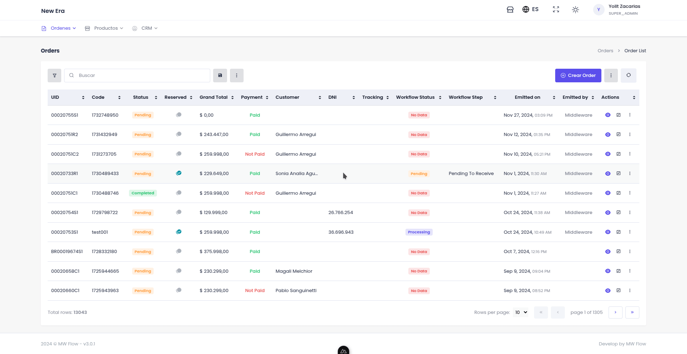
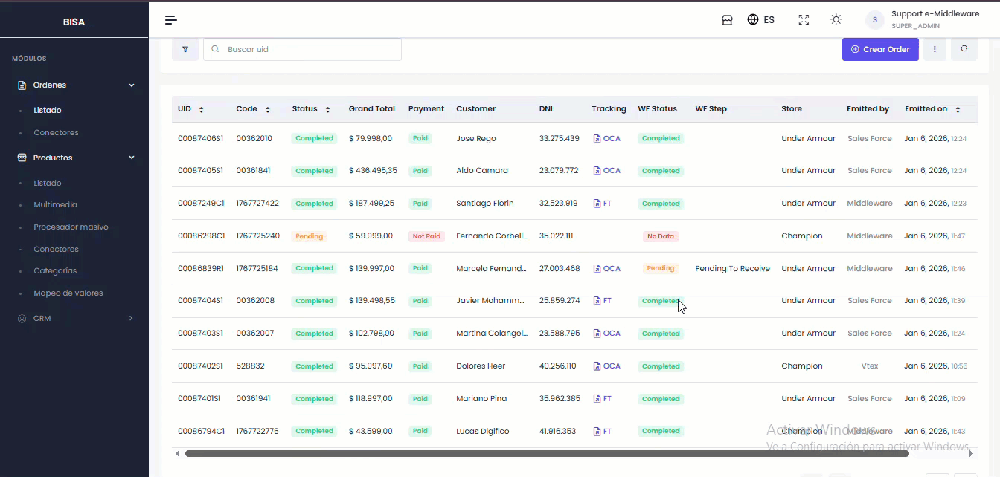

# 📦 Órdenes

Una **orden** es una compra: qué se llevó el comprador, cómo pagó y a dónde se envía. Entran solas
desde cada canal conectado y quedan en este listado, sin importar de dónde vengan.


📸 **Captura pendiente — `ord-listado-01`** · PNG

Listado de Órdenes con varias filas y estados distintos. Resaltar el toolbar superior y la columna
de estado. Sin datos reales de compradores.


## Qué puede hacer desde acá

| | |
|---|---|
| [Crear una orden](ordenes/crear.md) | Cargar una venta a mano (teléfono, mostrador, WhatsApp). |
| [Ver el detalle](ordenes/detalle.md) | Todo sobre una orden y las acciones disponibles. |
| [Cambiar el estado](ordenes/estados.md) | Mover la orden por su circuito. |
| [Postventa](ordenes/postventa.md) | Cambios, devoluciones y cancelaciones. |
| [Campos personalizados](campos-personalizados.md) | Sumar datos propios a la orden. |

Para buscar, filtrar, exportar o trabajar sobre muchas órdenes a la vez, todo funciona como en
cualquier listado: ver [Lo que se repite](../comunes/README.md).

## Traer una orden que no llegó

Si una venta existe en el canal pero no aparece acá, se puede pedir puntualmente con su **código de
referencia** (el identificador que le puso el canal).

1. En el toolbar, abra el menú de más opciones → **Sincronizar**.
2. Elija el **conector** de origen.
3. Pegue el **código de referencia** y confirme.

<figure><figcaption></figcaption></figure>


⚠️ Es una herramienta de excepción, no la forma normal de trabajar. Las órdenes deben entrar solas.
Si le falta más de una, no las traiga de a una: revise el [conector](conectores.md), que
probablemente esté fallando.



💡 El código de referencia está en la URL o en el detalle de la orden dentro del canal. Las
[Preguntas frecuentes](../acerca-de/preguntas-frecuentes-middleware.md) muestran dónde encontrarlo en
cada plataforma.


## Stock reservado

Cuando entra una orden, la plataforma **reserva** el stock de esos productos automáticamente. Los
movimientos se ven en el producto:

| Movimiento | Qué pasó |
|---|---|
| `RESERVED` | Se apartó stock para una orden pendiente. |
| `OUT` | El stock reservado se descontó del inventario. |
| `SKIP` | Se ajustó la reserva. |

<figure><figcaption></figcaption></figure>


⚠️ Una orden cancelada libera su reserva, pero **no de inmediato**: puede tardar unos minutos en
verse reflejado en el stock disponible del canal.


## Consultar órdenes desde su propio sistema

Su sistema puede leer y buscar órdenes por API, con los mismos filtros del panel. Ver
[Órdenes](https://docs.e-middleware.dev/public-api/ordenes) en la documentación técnica.
