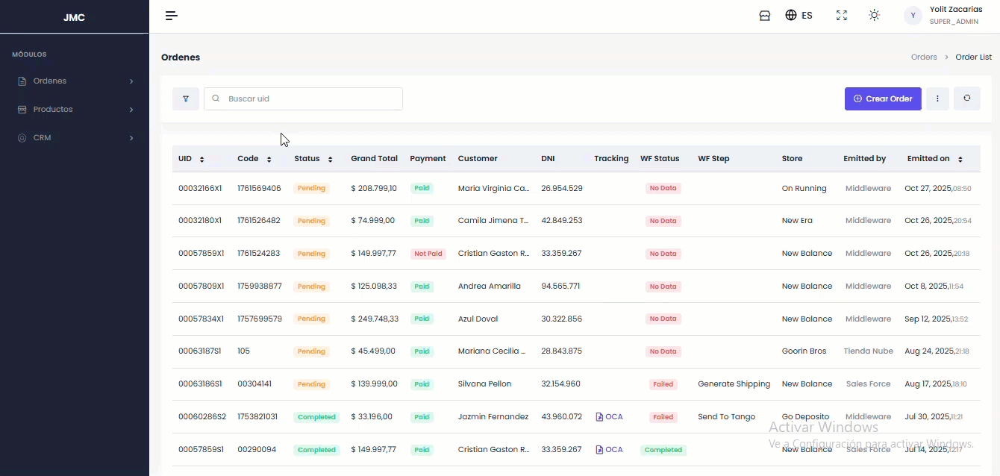

# ✏️ Editar Pedido

El proceso se realiza desde el listado (acceso rápido) o desde el detalle de la orden. Consta de 6 pasos:

**Paso 1: Información General**

* **Campos editables:** Código de referencia, Etiquetas (Tags), Fecha de emisión.

**Paso 2: Producto**

* **Campos editables:** Precio, Cantidad, Adición/Eliminación de productos.
* **Gestión de cupones:** Se pueden aplicar por producto o general, ingresando código, nombre y tipo de descuento (porcentual o precio fijo)


Los cambios aquí afectan el pago final y el monto abonado.


**Paso 3: Facturación**

* **Campos editables:** Datos del cliente (Nombre, Apellido, DNI, Email, Teléfono) y dirección de facturación.
* Se puede usar la misma información para el envío.

**Paso 4: Envío**

* Los campos se autocompletan si se usa la información de facturación.
* **Campos editables:** Dirección de envío (Nombre, Apellido, DNI, Email, Teléfono).

**Paso 5: Mensajería**

* **Campos editables:** Precio.
* Se puede seleccionar una empresa de envío alternativa.


Los cambios aquí afectan el pago final y el monto abonado.


**Paso 6: Pago**

* **Campos editables:** Transaction ID, Plataforma, Monto Total, Fecha de Pago.

<figure><figcaption></figcaption></figure>
