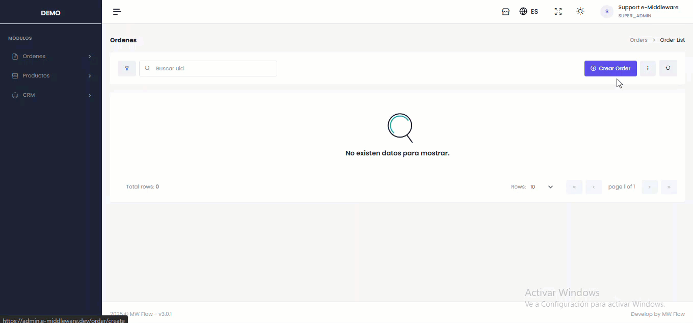
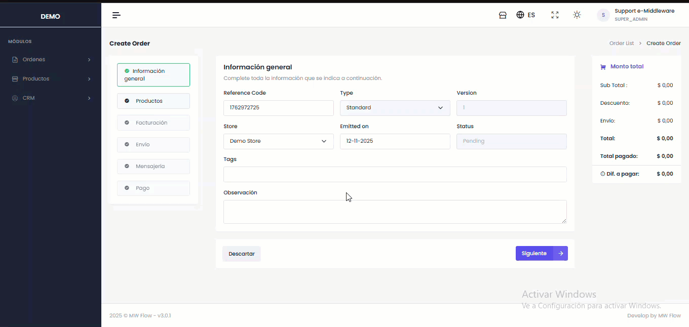
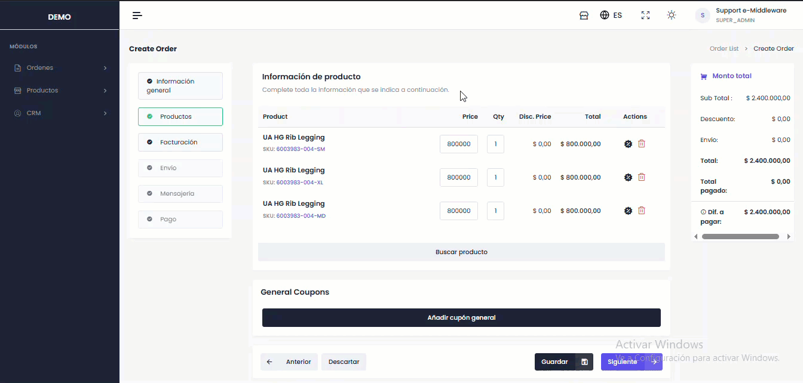
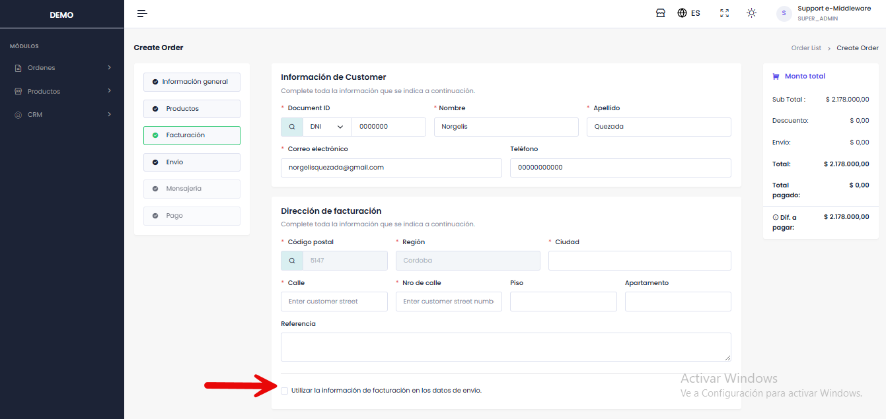
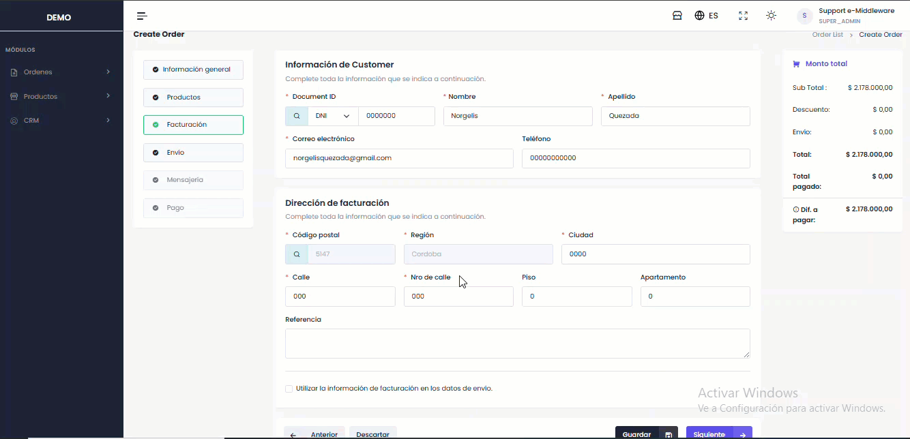

# 🆕 Nuevo Pedido

Al hacer clic en el botón **"Crear Orden"**.png>) se desplegará una ventana o pantalla modal con las siguientes secciones y campos obligatorios para completar:

### Paso 1 : Información General 

A continuación se presentan los campos que el usuario deberá completar:

1. **Código de referencia:** La plataforma genera automáticamente este código único para cada orden del cliente.&#x20;
2. **Etiquetas :**  Para clasificar y categorizar la orden.
3. **Fecha de emisión:** La fecha en que se crea el registro.
4. **Store:** El usuario deberá seleccionar  el destino de la orden.
5. **Estado:** El estado de la orden (Pendiente o Completado).

Para continuar, haga clic en "Siguiente". Si desea cancelar, seleccione "Descartar".

<figure><figcaption></figcaption></figure>

***

## Paso 2: Productos

#### Para añadir productos a la orden, siga los siguientes pasos:&#x20;

1. Haga clic en "Buscar producto" en la tabla de productos para ver las opciones disponibles.
2. Busque un producto por nombre o SKU en la lista desplegada.
3. Al seleccionar un producto, se rellenarán automáticamente: \
   3.1 Precio: Muestra el precio por unidad.\
   3.2 Cantidad: Permite especificar la cantidad deseada.\
   3.3 Monto total: Presenta el monto total.

Para continuar, haga clic en "Siguiente". Si desea cancelar, seleccione "Descartar".

<figure><figcaption></figcaption></figure>

#### Añadir cupones de descuento por producto&#x20;

Para aplicar un descuento a un producto, haga clic en el símbolo "%". Se abrirá un modal donde debe ingresar:

* **Código y nombre del cupón** (generado o personalizado).
* **Tipo de descuento** (porcentaje o precio fijo).

<figure><figcaption></figcaption></figure>

***

## Paso 3: Facturación

#### **Información del Cliente**

1. Haga clic en "Buscar cliente" para seleccionar un cliente registrado. La búsqueda se puede realizar por DNI, Nombre, Email.
2. Ingrese los datos del cliente: **Nombre, DNI, Email** y **Teléfono**

<figure><figcaption></figcaption></figure>

#### **Dirección de Facturación**

1. Añada una dirección de envío. Los campos Ciudad, Calle, Piso, apartamento y referencia pueden ser completados por el usuario.
2. Active la casilla para usar la misma información de facturación para el envío, si lo desea.

<figure><figcaption></figcaption></figure>

***

## **Paso 4: Envío**

#### **Información del Cliente**

Para completar esta sección, **repita el mismo procedimiento** utilizado en la sección de **Facturación**.

* **Busque** un cliente existente usando "Buscar cliente".
* O **ingrese manualmente** los datos del cliente (Nombre, Apellido, DNI, Email, Teléfono) en los campos correspondientes.

#### **Dirección de Envio**

1. Añada una dirección de envío. Rellene los campos correspondientes.

Para continuar, haga clic en "Siguiente". Si desea cancelar, seleccione "Descartar"

<figure><figcaption></figcaption></figure>

***

## Paso 5: Mensajería


La mensajería es un paso opcional, dentro de la creación de una orden, si lo desea puede seleccionar de manera manual por que tipo de encomienda desea realizar el envío


Para seleccionar una encomienda de preferencia se debe realizar lo siguiente:

1. presione el botón “buscar” ubicada en el lateral del input de company y seleccione la compañía habilitada para el envio

Para adicionar un cobro de envío se debe realizar lo siguiente:

1. **Price (Precio)** Agregar el monto de su preferencia para el envio.
2. **Observation (Observación)** Podrá ingresar observaciones adicionales si lo desea.

Para continuar, haga clic en "Siguiente". Si desea cancelar, seleccione "Descartar".

<figure><figcaption></figcaption></figure>

**NOTA: VIDEO DEMOSTRATIVO DE LA SECCION DE MENSAJERIA PASO A PASO.**

***

## **Paso 6: Pago**

Los campos obligatorios para registrar un pago son los siguientes:

1. **Transaction ID (Numero de Transaccion):** Numero de transacción que identifica la operación bancaria realizada
2. **Plataform (Plataforma):** Seleccione la plataforma de pago correspondiente
3. **Total Amount (Monto Total ):** Monto de la transacción
4. **Payment Date (Fecha de Pago):** Fecha en la que se realizó el pago
5. El sistema permite agregar como maximo tres (3) pagos adicionales.

Para finalizar la orden, haga clic en el botón "Finalizar". A continuación, se mostrará un modal con el resumen del pedido, que le permitirá visualizar y corroborar la información. Una vez validada, presione "Confirmar" para generar la nueva orden.

**NOTA:IMAGEN**
