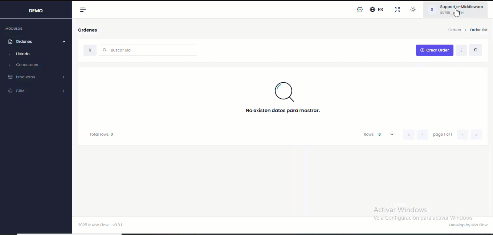

# Cambiar Contraseña

#### **1. Acceso al Sistema**

* Ingresa a la plataforma a través del enlace de inicio de sesión proporcionado en tu navegador web.

#### **2. Autenticación**

* Ingresa tus credenciales actuales:
  * **Correo Electrónico**: Tu dirección de email registrada.
  * **Contraseña**: Tu contraseña actual.
* Selecciona **Iniciar Sesión** para acceder.

#### **3. Solicitud de Cambio**

* Localiza y selecciona la opción **Cambiar contraseña** en el menú de usuario.

#### **4. Actualización de Credenciales**

* En el formulario de cambio de contraseña, proporciona:
  * **Correo Electrónico**: Tu email registrado.
  * **Nombre y Apellido**: Tus datos personales.
  * **Contraseña Actual**: Tu clave vigente.
  * **Nueva Contraseña**: La clave que deseas establecer.

#### **5. Confirmación del Cambio**

* Verifica que todos los campos estén correctamente completados.
* Presiona el botón **Restablecer Contraseña** para aplicar los cambios.

#### **6. Verificación**

* El sistema confirmará el cambio exitoso.

<figure><figcaption></figcaption></figure>
